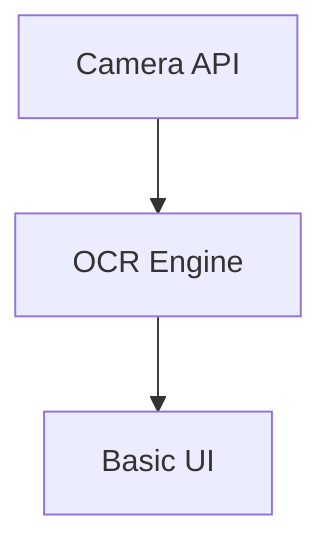

# CASE_OS Documentation Index
Last Updated: 2024-12-17 23:18:04 PST

## Current Sprint: SWIFTFILL PRO MVP
- [MVP Camera Integration Test Plan](#mvp-camera) - 2024-12-17 23:18
- [SWIFTFILL PRO Strategy](#swiftfill-strategy) - 2024-12-17 23:10
- [System Architecture](#architecture) - 2024-12-17 23:07

## Development Log
- [Latest Updates](./DEV_LOG.md)

## Documentation Sections
### MVP Camera Test Plan 

[Details](./MVP_CAMERA_TEST.md)

### SWIFTFILL PRO Strategy 
- Universal form filling solution
- Government, Healthcare, Legal services
- Personal Data Trust + ΞGRAPH Intelligence
[Details](./SWIFTFILL_PRO_STRATEGY.md)

### System Architecture 
- Personal Data Trust
- Evidence Graph System
- Form Processing Pipeline
[Details](./SYSTEM_ARCHITECTURE.md)

## Quick Links
- [README](../README.md)
- [Components](../case-os-chat/components/)
