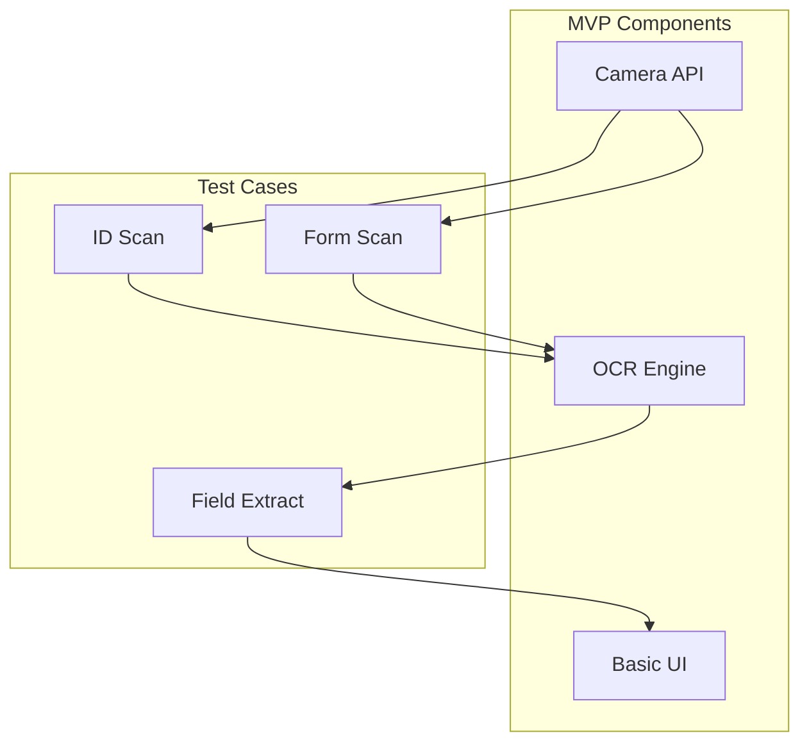

# MVP Camera Integration Test Plan
Created: 2024-12-17 23:18:04 PST

## Immediate Test Goals (Next 2 Hours)
1. Camera access & capture
2. OCR processing
3. Form field mapping
4. Basic UI display

## Tech Stack Validation


## Test Stack Options

### 1. Camera Integration
- React Native Camera
- Expo Camera
- PWA Camera API
- Native iOS/Android

### 2. OCR Options
- Google Cloud Vision
- Tesseract.js
- Microsoft Computer Vision
- AWS Textract

### 3. Form Processing
- Form Recognizer
- Custom ML Model
- Rule-based Mapping

## Quick Test Implementation
```typescript
// Basic camera test component
const CameraTest = () => {
  const [hasPermission, setHasPermission] = useState(null);
  const [image, setImage] = useState(null);
  const [results, setResults] = useState(null);

  // Test cases to validate
  const testCases = {
    idScan: async () => {
      // ID photo capture
      // OCR processing
      // Field extraction
    },
    formScan: async () => {
      // Form capture
      // Field detection
      // Data mapping
    }
  };
};
```

## Success Criteria
- Camera capture < 2s
- OCR accuracy > 90%
- Field mapping > 80%
- UI response < 1s

## Next Steps (Priority Order)
1. Camera test deployment
2. OCR integration
3. Basic form mapping
4. Simple UI display

Ready to implement fastest option first - which test stack would you like to validate?
