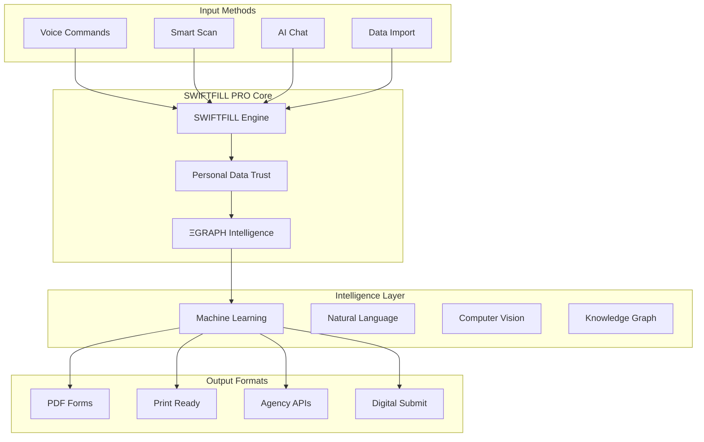

# SWIFTFILL PRO by CaseOS
## Universal Intelligent Form Assistant

### Vision Statement
SWIFTFILL PRO transforms bureaucratic inefficiency into seamless experiences by providing an AI-powered universal form completion system that works across all government agencies, medical offices, and legal institutions.

### Market Opportunities

#### 1. Government Services
- **DMV Forms**
  - License renewal
  - Vehicle registration
  - Title transfers
  - Address changes
  
- **Tax Forms**
  - Income tax returns
  - Property tax assessments
  - Business tax registration
  - Tax appeals

- **Immigration Forms**
  - Visa applications
  - Green card renewals
  - Citizenship applications
  - Status adjustments

#### 2. Healthcare
- **Patient Intake**
  - Medical history
  - Insurance verification
  - Consent forms
  - HIPAA documentation

- **Insurance Claims**
  - Claim submissions
  - Appeals
  - Prior authorizations
  - Benefits verification

#### 3. Legal Services
- **Court Filings**
  - Civil cases
  - Family law
  - Small claims
  - Criminal defense

- **Legal Documents**
  - Contracts
  - Declarations
  - Affidavits
  - Powers of attorney

### Core Technologies



### Competitive Advantages

1. **Universal Data Trust**
   - Fill once, use everywhere
   - Secure data vault
   - Smart field mapping
   - Cross-form intelligence

2. **Multimodal Input**
   - Voice-first interface
   - Smart document scanning
   - AI chat assistance
   - Bulk data import

3. **Intelligent Processing**
   - Form field prediction
   - Error prevention
   - Compliance checking
   - Real-time validation

4. **Agency Integration**
   - Direct submission APIs
   - Digital signatures
   - Status tracking
   - Update notifications

### Revenue Streams

1. **Consumer Plans**
   ```
   Basic: $4.99/month
   - 10 forms/month
   - Basic data storage
   - Standard support
   
   Pro: $9.99/month
   - Unlimited forms
   - Advanced features
   - Priority support
   
   Family: $14.99/month
   - 5 family members
   - Shared data vault
   - Premium support
   ```

2. **Enterprise Solutions**
   ```
   Office Basic: $199/month
   - Up to 5 staff
   - Custom forms
   - API access
   
   Office Pro: $499/month
   - Up to 20 staff
   - White label
   - Priority API
   
   Enterprise: Custom
   - Unlimited staff
   - Full customization
   - Dedicated support
   ```

3. **Agency Partnerships**
   - Integration licensing
   - API usage fees
   - Custom development
   - Support contracts

### Implementation Roadmap

#### Phase 1: Foundation (Q1 2024)
- Core engine development
- Personal Data Trust
- Basic form processing
- Initial agency forms

#### Phase 2: Intelligence (Q2 2024)
- ΞGRAPH implementation
- Advanced AI features
- Pattern recognition
- Error prevention

#### Phase 3: Integration (Q3 2024)
- Agency API connections
- Direct submissions
- Status tracking
- Payment processing

#### Phase 4: Expansion (Q4 2024)
- Additional agencies
- Enterprise features
- White label options
- International support

### Success Metrics

1. **User Impact**
   - Time saved per form
   - Error reduction rate
   - User satisfaction
   - Return usage rate

2. **Business Growth**
   - Monthly active users
   - Form completion rate
   - Revenue per user
   - Agency adoption

3. **Technical Performance**
   - Processing accuracy
   - System uptime
   - Response time
   - API reliability

### Security & Compliance

1. **Data Protection**
   - End-to-end encryption
   - Zero-knowledge storage
   - Access control
   - Audit logging

2. **Compliance**
   - HIPAA
   - GDPR
   - CCPA
   - SOC 2
   - ISO 27001

### Next Steps

1. **Immediate Actions**
   - Finalize core architecture
   - Begin agency partnerships
   - Start MVP development
   - Initial user testing

2. **Key Decisions**
   - Priority agencies
   - Launch markets
   - Pricing strategy
   - Partnership model

3. **Resource Needs**
   - Development team
   - Agency relations
   - Legal compliance
   - Marketing strategy
