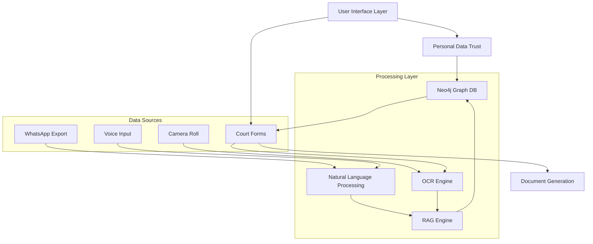
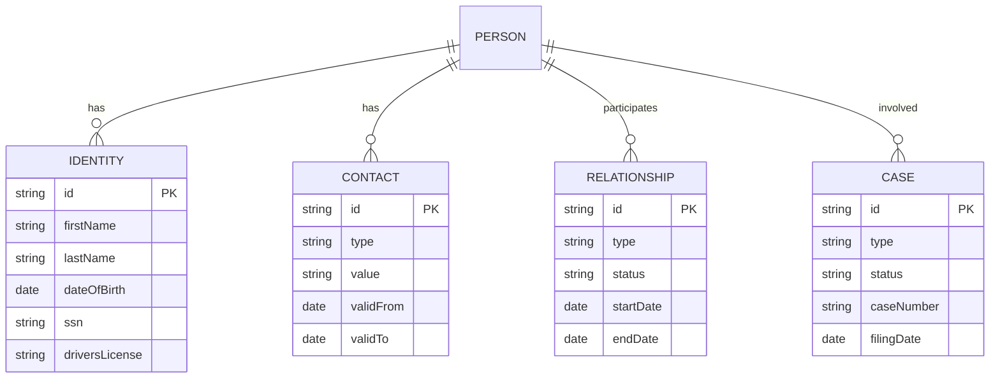
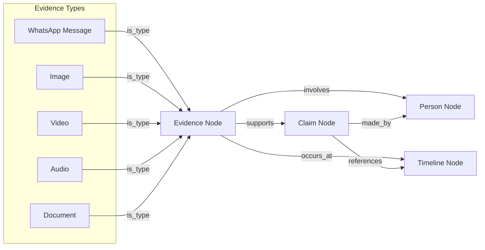
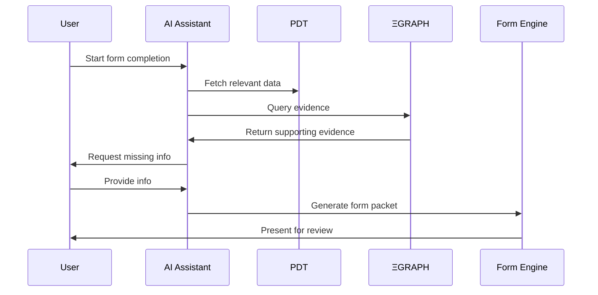
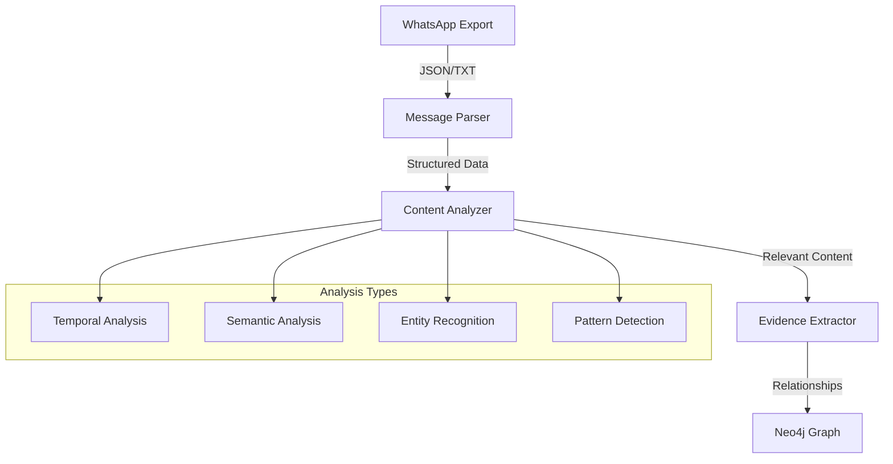
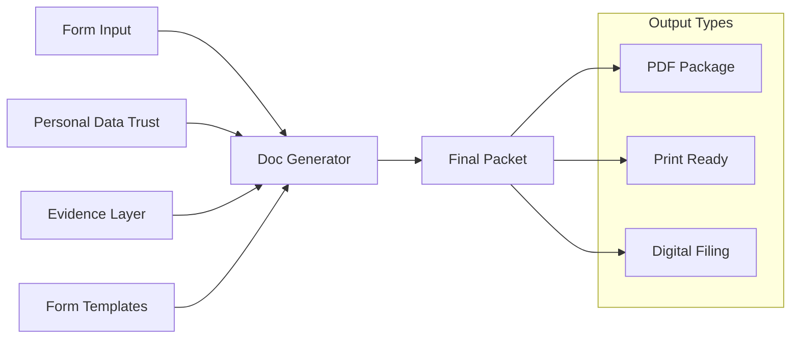

# CASE_OS System Architecture

## System Overview Diagram

## Personal Data Trust Schema

## ΞGRAPH Evidence Layer

## Form Processing Flow

## WhatsApp Integration Architecture

## Document Generation Pipeline

