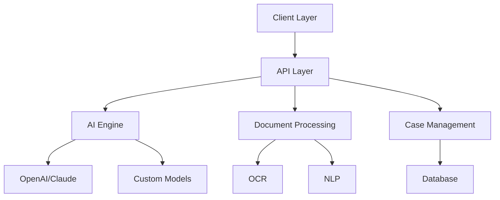
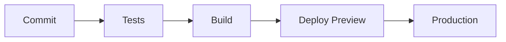

# 🛠 CASE_OS: Technical Documentation & Roadmap

## 📑 Table of Contents
- [Architecture](#-architecture)
- [Getting Started](#-getting-started)
- [Development Roadmap](#-development-roadmap)
- [Tech Stack](#-tech-stack)
- [Contributing](#-contributing)

## 🏗 Architecture

### Core Components


### Key Features
1. **Multimodal Input Processing**
   - Document upload & analysis
   - Voice-to-text transcription
   - Image evidence processing

2. **AI-Powered Legal Assistant**
   - Context-aware responses
   - Legal research automation
   - Document generation

3. **Case Management System**
   - Deadline tracking
   - Document organization
   - Progress monitoring

## 🚀 Getting Started

### Prerequisites
```bash
node >= 18.0.0
npm >= 9.0.0
```

### Installation
```bash
git clone https://github.com/yourusername/case-os.git
cd case-os
npm install
```

### Environment Setup
```bash
cp .env.example .env.local
# Add your API keys and configuration
```

### Running Locally
```bash
npm run dev
# Open http://localhost:3000
```

## 📅 Development Roadmap

### Phase 1: Foundation (Q1-Q2 2024)
- [x] Project setup
- [x] Basic authentication
- [x] Document upload
- [ ] AI integration
- [ ] Basic case management

### Phase 2: Core Features (Q3-Q4 2024)
- [ ] Advanced document processing
- [ ] Legal form generation
- [ ] Case law integration
- [ ] Real-time collaboration
- [ ] Payment processing

### Phase 3: Advanced Features (2025)
- [ ] Multi-jurisdiction support
- [ ] Advanced AI models
- [ ] Mobile application
- [ ] API marketplace
- [ ] Enterprise features

## 🛠 Tech Stack

### Frontend
- Next.js 14
- TypeScript
- Tailwind CSS
- Framer Motion
- Vercel AI SDK

### Backend
- Node.js
- Next.js API Routes
- PostgreSQL
- Redis
- WebSocket

### AI/ML
- OpenAI GPT-4
- Claude 3
- Custom Models
- Whisper ASR

### Infrastructure
- Vercel
- AWS
- Docker
- Kubernetes

## 🤝 Contributing

### Getting Started
1. Fork the repository
2. Create your feature branch
3. Commit your changes
4. Push to the branch
5. Create a Pull Request

### Development Guidelines
- Follow TypeScript best practices
- Write tests for new features
- Update documentation
- Follow commit message conventions

### Code Style
```typescript
// Example of our coding style
interface LegalDocument {
  id: string;
  type: DocumentType;
  content: string;
  metadata: DocumentMetadata;
}

class DocumentProcessor {
  async analyze(doc: LegalDocument): Promise<Analysis> {
    // Implementation
  }
}
```

## 📚 Documentation

### API Reference
- [Authentication](/docs/api/auth.md)
- [Documents](/docs/api/documents.md)
- [Cases](/docs/api/cases.md)
- [AI Endpoints](/docs/api/ai.md)

### Guides
- [Architecture Overview](/docs/guides/architecture.md)
- [Development Setup](/docs/guides/setup.md)
- [Testing Guide](/docs/guides/testing.md)
- [Deployment Guide](/docs/guides/deployment.md)

## 🔒 Security

### Standards
- SOC 2 Type II compliance
- GDPR compliance
- CCPA compliance
- Bar association guidelines

### Practices
- End-to-end encryption
- Regular security audits
- Penetration testing
- Access control

## 📈 Performance

### Targets
- API Response: < 100ms
- Uptime: 99.99%
- Error Rate: < 0.1%
- Concurrent Users: 100k+

### Monitoring
- Real-time metrics
- Error tracking
- Performance monitoring
- User analytics

## 🧪 Testing

### Framework
- Jest
- React Testing Library
- Cypress
- k6 for load testing

### Coverage Requirements
- Unit Tests: 90%
- Integration Tests: 80%
- E2E Tests: 70%

## 📱 Mobile Development

### Platforms
- Progressive Web App
- React Native (future)
- Native iOS/Android (future)

### Features
- Offline support
- Push notifications
- File access
- Biometric auth

## 🌐 Internationalization

### Languages
- English (default)
- Spanish
- French
- German
- Mandarin

### Localization
- UI elements
- Legal documents
- AI responses
- Documentation

## 🔄 CI/CD

### Pipeline


### Tools
- GitHub Actions
- Vercel
- Docker
- Kubernetes

## 📊 Analytics

### Metrics
- User engagement
- Feature usage
- Error rates
- Performance

### Tools
- Mixpanel
- Sentry
- LogRocket
- Custom analytics

---

*For more information, contact the development team or refer to our [documentation portal](/docs).*
